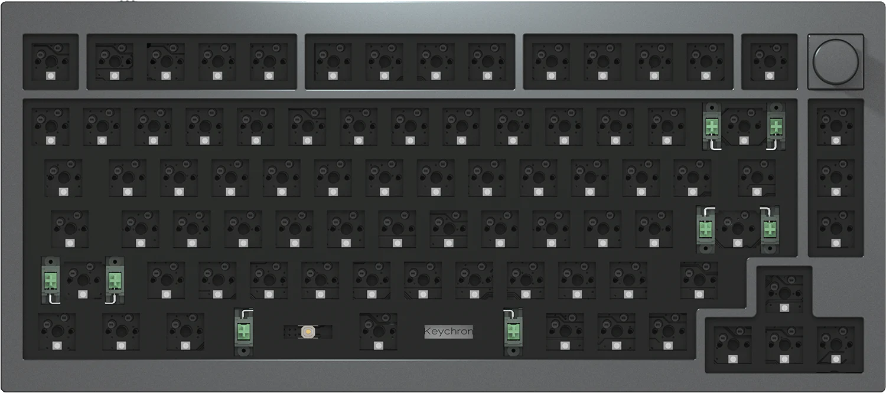
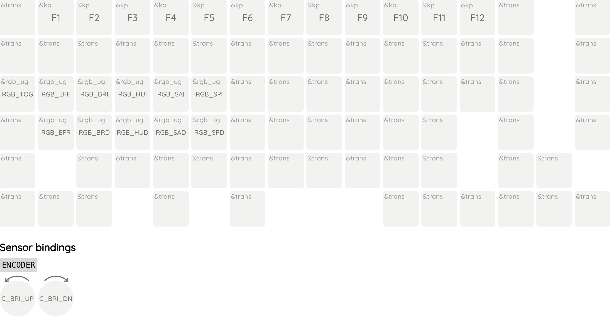
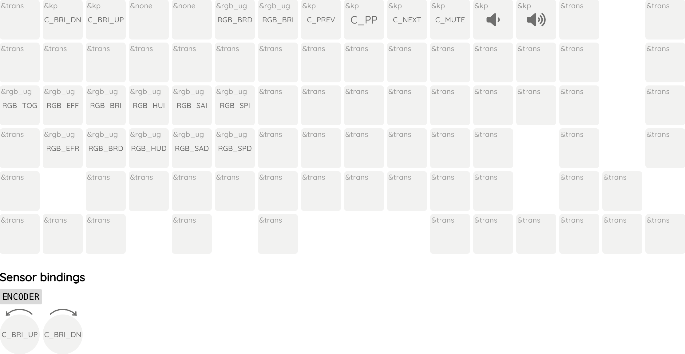

Keychron Q1
========



[Q1](https://www.keychron.com/products/keychron-q1) is a hotswap 75% mechanical keyboard made by Keychron.

This repository is the configuration used to build [ZMK firmware](https://github.com/zmkfirmware/zmk) for Keychron Q1 (Version 2, as well as the "sspai customized version").

## Flash

1. Download the latest build of ZMK firmware from [Releases](https://github.com/xingrz/zmk-config_keychron_q1/releases)
2. Enter DFU mode by holding the "RESET" button hidden under the space bar keycap and re-plug your USB cable
2. Open [WebDFU](https://devanlai.github.io/webdfu/dfu-util/), select the firmware, and then click "Download"

## Customize

You can fork this repository to your own GitHub account and do any modification.

### Keymap

This firmware is designed to closely mimic the default keymap of the [factory firmware](https://www.keychron.com/blogs/archived/how-to-reset-your-keychron-q1-to-factory-settings), with the exception of the right `Control` key in the Mac layout, which has been changed to the `Option` key to match the layout on MacBooks. You can customize it using the [ZMK Keymap Editor](https://nickcoutsos.github.io/keymap-editor/) or by manually editing the [`keychron_q1.keymap`](/config/keychron_q1.keymap) file.

#### Mac, default


#### Mac, "Fn" pressed



#### Win, default


#### Win, "Fn" pressed



### Lights

* `Fn` + `Tab`: Toggle
* `Fn` + `Q`/`A`: Change effects
* `Fn` + `W`/`S`: Change brightness
* `Fn` + `E`/`D`: Change hue
* `Fn` + `R`/`F`: Change saturation
* `Fn` + `T`/`G`: Change animation speed

## Development

Follows [ZMK documentation](https://zmk.dev/docs/development/setup#prerequisites)。

```sh
west init -l config
west update
west zephyr-export
west build -s zmk/app -b keychron_q1 -- -DZMK_CONFIG=$PWD/config
west flash
```
